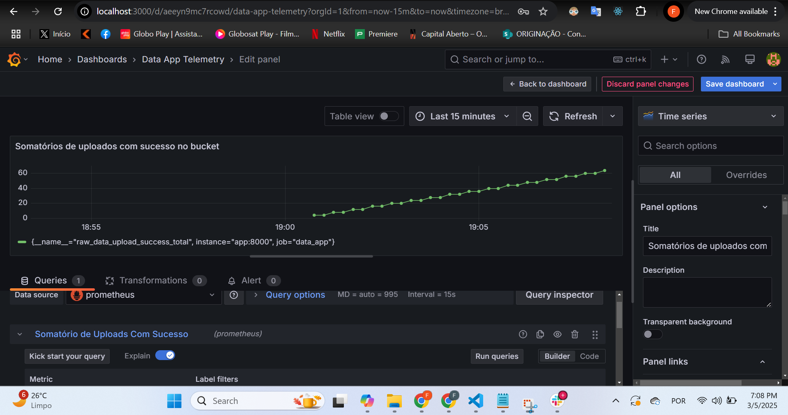

# Telemetry Dashboards

## Sumário
1. [Compreensão dos Dados](#1-compreensao-dos-dados-25)
2. [Seleção de Métricas Relevantes](#2-selecao-de-metricas-relevantes)
3. [Eficiência na Integração de Dados](#3-eficiencia-na-integracao-de-dados)
4. [Design e Usabilidade do Dashboard](#4-design-e-usabilidade-do-dashboard)
5. [Análise e Interpretação dos Resultados](#5-analise-e-interpretacao-dos-resultados)
6. [Evidências](#evidencias)

---

### 1. Compreensão dos Dados
Na arquitetura medallion, a camada Bronze é responsável pelo armazenamento dos dados brutos em um bucket. Neste projeto, os dados são coletados a partir de diversas fontes (como veículos, status, resultados e falhas) e armazenados no formato Parquet, preservando tanto a integridade quanto os metadados essenciais (como file_path e classification_id). Essa estrutura permite rastrear o fluxo dos dados desde a ingestão até as camadas posteriores de transformação e análise, garantindo visibilidade e auditabilidade em toda a jornada dos dados.

### 2. Seleção de Métricas Relevantes
Para resolver 80% dos problemas com uma abordagem simples, foram selecionadas métricas essenciais que atendem aos principais pontos de monitoramento:
- **Contagem de Requisições:** Quantifica o número de acessos à API, permitindo avaliar a carga do sistema.
- **Latência das Requisições:** Mede o tempo de resposta da aplicação, identificando possíveis gargalos.
- **Sucesso e Falha no Upload:** Monitora os uploads para o bucket, fornecendo insights sobre a confiabilidade e desempenho da fase Bronze.
- **Outras Métricas Complementares:** Podem incluir contadores para mensagens processadas, erros em consumidores e tempo de processamento de uploads.

Essa seleção de métricas permite uma visão ampla e imediata da saúde e eficiência do processo de ingestão dos dados.

### 3. Eficiência na Integração de Dados
A integração dos dados de telemetria é realizada por meio da instrumentação da aplicação com Prometheus. Ao expor as métricas via um endpoint (/metrics), o Prometheus consegue coletar informações de todos os componentes envolvidos (FastAPI, consumidores, publicadores) de maneira centralizada e contínua. Essa abordagem unifica as fontes de dados em um único canal, simplificando a análise e permitindo que o Grafana construa dashboards com uma visão integrada e consolidada do fluxo de dados, sem a necessidade de integrar múltiplos sistemas de monitoramento.

### 4. Design e Usabilidade do Dashboard
No Grafana, o dashboard deve ser desenhado para oferecer uma experiência de usuário intuitiva e organizada:
- **Visualizações Claras:** Utilizar gráficos de séries temporais para monitorar a latência e contadores para uploads e requisições.
- **Organização Lógica:** Agrupar métricas relacionadas à ingestão, processamento e upload, possibilitando a rápida identificação de problemas.
- **Interatividade:** Incluir filtros temporais e painéis com indicadores numéricos que permitam uma análise rápida dos dados.
- **Design Atraente:** Manter um layout limpo e responsivo, alinhado com os princípios do clean code, para facilitar a compreensão e a tomada de decisões rápidas.

Esses elementos asseguram que o dashboard não apenas exiba dados, mas também ofereça insights práticos para otimizações contínuas.

### 5. Análise e Interpretação dos Resultados
A partir das métricas coletadas, é possível identificar tendências e padrões importantes:
- **Picos de Carga e Latência:** Indicam momentos de maior utilização do sistema, auxiliando no dimensionamento de recursos. No caso, o valor de 2 segundos indica que não estamos com resultados satisfatórios.
- **Taxas de Sucesso/Erro no Upload:** Revelam a confiabilidade do processo de ingestão, possibilitando intervenções rápidas em caso de falhas.
- **Comparativo Temporal:** Permite a análise de evolução do desempenho do sistema, contribuindo para decisões estratégicas.

Essa análise gera insights valiosos que podem orientar a otimização dos processos, melhorando a eficiência operacional e garantindo a qualidade dos dados ao longo do pipeline.

---

## Evidências

Em resumo, ao utilizar Prometheus para coletar métricas expostas pela sua aplicação e o Grafana para construir dashboards interativos e organizados, você estabelece uma solução de telemetria robusta e escalável.

### Imagem 1: Evidências Grafana com o somatório de uploads com sucesso

### Imagem 2: Evidências do Grafana com a criação da métrica duração média do upload

### Imagem 3: Evidências do funcionamento do Prometheus

